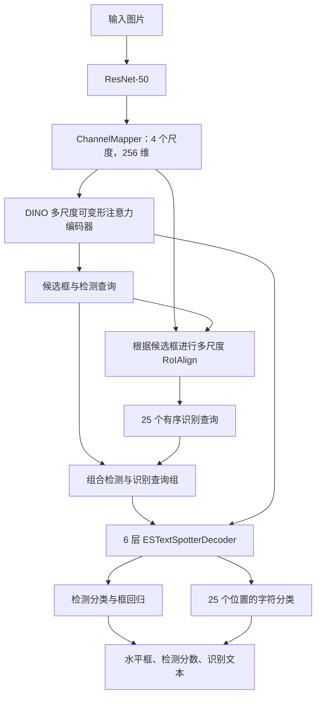

# OCRDINO

基于 MMDetection 3.3.0，将 DINO 目标检测器扩展为同时完成**文本定位与文本识别**的 OCR 模型。

本文主要介绍仓库中采用 **MLT2017 + CurvedSynText150k 预训练，再在 Total-Text 上微调**的版本。对应的模型类是 `ESTDINOTotalText`，核心结构由 `ESTDINO`、`ESTextSpotterDecoder` 和 `ESTDINOHead` 实现。

输入一张图片，模型输出每个文本实例的水平框、检测分数和识别字符串。训练和推理共用视觉特征与查询解码器，识别任务参与模型的联合学习。

## 1. 项目思路

DINO 已经能够通过多尺度视觉特征、候选框和 Transformer 查询回答“目标在哪里”。OCR 还需要回答“框内写了什么”。本项目将一个候选文本实例表示为一组查询：

```text
[D, R0, R1, ..., R24]
 │   └──────────────┘
 │     25 个有序识别查询
 └── 1 个检测查询
```

检测查询负责文本类别和边界框；识别查询负责按顺序预测字符。两类查询属于同一实例，在解码过程中交换信息，并共同读取图像特征。

这套设计有三个重点：

1. **让识别查询从候选区域的视觉特征出发。** 利用 DINO 的候选框，通过多尺度 RoIAlign 提取区域特征，再沿水平方向形成有序字符查询，使识别分支具有明确的空间起点。
2. **让定位与识别在解码器内交互。** VLC（Vision-Language Communication）把字符预测分布映射成语义特征，与视觉查询进行注意力交互，使文本内容能够参与后续特征更新。
3. **先学习通用文字特征，再适应目标数据。** 在三个文本数据集上训练完整模型，再用 Total-Text 微调。微调继承预训练的检测、识别和交互模块，并使用新的优化器从第 1 个 epoch 开始训练。

其中的“语言”信息来自模型自身的字符分类分布，代码使用可学习的线性投影与注意力实现交互。

## 2. 模型如何实现

### 2.1 整体流程



当前主线配置的关键参数：

| 部分 | 设置 |
| --- | --- |
| Backbone | ResNet-50，输出 C3/C4/C5 |
| 特征映射 | ChannelMapper，输出 4 个尺度，通道数 256 |
| 编码器 | 6 层多尺度可变形注意力 |
| 常规检测查询 | 100 个；训练时另有 DN 查询 |
| 每个实例的识别查询 | 25 个 |
| RoIAlign 输出 | `256 × 8 × 25`，沿高度取均值后形成字符序列 |
| 联合解码器 | 6 层，8 个注意力头，4 个特征尺度 |
| 检测类别 | 1 类：`text` |
| 识别类别 | 97 类 |

### 2.2 从 DINO 到文本实例查询组

`ESTDINO` 继承 DINO，复用其特征编码、候选框生成和去噪查询机制，并将原检测解码器替换为 `ESTextSpotterDecoder`。

`TaskAwareRecognitionQueryInitializer` 根据候选框大小选择特征层，通过 RoIAlign 得到固定尺寸区域特征，沿高度平均后得到 `[B, N, 25, 256]` 的识别查询。这里 `B` 为 batch size，`N` 为当前实例查询数。RoI 初始化使用 stride 为 8、16、32 的前三个尺度；编码器和联合解码器的视觉注意力使用全部四个尺度。

`TaskAwareTextQueryGroupBuilder` 将检测查询与识别查询拼接成 `[B, N, 26, 256]`，并构造有序位置编码。字符位置由 1D 正弦位置编码区分。

### 2.3 联合解码与 VLC

每层解码器按以下顺序更新查询：

```text
字符预测分布 → 语义投影
                 ↓
VLC → 实例内部自注意力 → 同一槽位的跨实例自注意力
    → 多尺度可变形交叉注意力 → FFN
    → 本层字符预测与边界框更新
```

- **VLC：** 将识别查询的 97 类 logits 经 softmax 得到字符概率，再投影回 256 维语义特征。视觉查询作为 Query，语义特征作为 Key/Value；检测槽位保留自身的视觉特征。注意力掩码禁止槽位直接关注自身，促进组内信息交换。
- **实例内部注意力：** 同一个文本框内的检测查询与字符查询交互。
- **跨实例注意力：** 不同实例的相同槽位交互，例如检测槽位之间、各实例的第一个字符槽位之间。训练时沿用 DINO 的 DN 隔离掩码。
- **视觉交叉注意力：** 查询继续从编码器的多尺度图像 memory 获取视觉信息。
- **逐层预测：** 每层输出字符 logits，并迭代更新实例边界框；字符分类器和字符语义投影在各解码层间共享。

模型同时优化定位和识别，识别损失能够更新共享视觉特征及查询交互模块。当前配置中的 RoI 框坐标会 detach，解码层之间的参考框也会 detach。

### 2.4 训练监督

检测分支保留 DINO 的分类、L1 框回归、GIoU，以及编码器辅助损失和 DN 损失。识别分支使用固定位置的字符交叉熵。

常规查询在每个解码层根据本层检测预测，重新通过 Hungarian matching 与 GT 一对一匹配。匹配成本由类别、边界框 L1 和 GIoU 构成，字符预测不参与匹配成本；本层识别监督使用本层匹配到的 GT 文本，保持框与字符串的一一对应。

识别输出形状为 `[L, B, N, 25, 97]`，`L` 为解码层数。识别在各解码层受到监督；DN 正查询直接使用对应 GT 文本，并在各层共享目标。未匹配查询、DN 负查询及没有识别目标的位置使用 `-100` 忽略。

字符交叉熵按有效字符数进行分布式归一化。最终层识别损失为 `loss_rec`、`dn_loss_rec`，前五层还有对应的辅助识别损失。

主线配置的检测损失权重为：分类 `1.0`、L1 `5.0`、GIoU `2.0`；常规识别和 DN 识别权重均为 `1.0`。Hungarian 匹配成本权重为类别 `2.0`、L1 `5.0`、GIoU `2.0`。

### 2.5 字符编码与预测

当前版本采用固定的 97 类字符编码，无需生成外部词表：

| Token ID | 含义 |
| --- | --- |
| `0～94` | ASCII 32～126，即空格、英文大小写、数字和常见标点 |
| `95` | UNK，不支持的字符 |
| `96` | EOS，结束符 |

每个文本的监督序列固定为 25 位。例如：

```text
HELLO → [40, 37, 44, 44, 47, 96, ..., 96]
```

不足 25 个字符时，剩余位置全部补 EOS；达到或超过 25 个字符时保留前 25 个字符。模型并行预测各位置，推理时逐位置取 argmax，遇 EOS 结束，UNK 显示为 `�`。

当前 tokenizer 不进行大小写转换或空格清理。中文等非 ASCII 字符会转换为 UNK。

## 3. 代码结构

| 文件 | 作用 |
| --- | --- |
| [est_dino.py](mmdet/models/detectors/est_dino.py) | 接入识别查询、查询组和联合解码器，组织训练前向 |
| [est_dino_totaltext.py](mmdet/models/detectors/est_dino_totaltext.py) | 对齐检测与识别查询索引，输出 Total-Text 推理结果 |
| [text_spotting_layers.py](mmdet/models/layers/transformer/text_spotting_layers.py) | RoI 识别查询初始化、查询组、有序位置编码等组件 |
| [estext_spotter_decoder.py](mmdet/models/layers/transformer/estext_spotter_decoder.py) | VLC、实例内/实例间注意力、联合解码与逐层预测 |
| [est_dino_head.py](mmdet/models/dense_heads/est_dino_head.py) | DINO 检测损失、匹配识别损失与 DN 识别损失 |
| [ocr_dino_dataset.py](mmdet/datasets/ocr_dino_dataset.py) | 统一 OCRDINO 数据格式 |
| [ocr_dino_transforms.py](mmdet/datasets/transforms/ocr_dino_transforms.py) | OCR 标注加载、97 类编码及输入打包 |
| [ocrdino_totaltext_metric.py](mmdet/evaluation/metrics/ocrdino_totaltext_metric.py) | 水平框检测、识别与端到端评估 |
| [configs/ocrdino](configs/ocrdino) | 模型与训练配置 |
| [visualize_ocrdino_totaltext.py](tools/analysis_tools/visualize_ocrdino_totaltext.py) | 测试集可视化与 JSON 导出 |

## 4. 环境安装

现有训练配置使用 Linux 路径、NCCL 和 Bash 分布式脚本。以下命令按 Linux + NVIDIA GPU 环境编写，在仓库根目录执行。

先安装与机器 CUDA 环境匹配的 PyTorch，再安装本项目依赖：

```bash
python -m pip install openmim
mim install "mmengine>=0.7.1,<1.0.0"
mim install "mmcv>=2.0.0rc4,<2.2.0"
python -m pip install -v -e .
python -m pip install Pillow
```

MMCV 必须包含 `mmcv.ops`，模型需要多尺度可变形注意力和 RoIAlign 算子。上述 MMCV/MMEngine 范围来自仓库的版本检查；PyTorch、CUDA 与 MMCV 的构建应配套。

可检查当前导入是否使用此仓库：

```bash
python -c "import torch, mmcv, mmengine, mmdet; from mmcv.ops import MultiScaleDeformableAttention, RoIAlign; print('torch:', torch.__version__, 'cuda:', torch.version.cuda); print('mmcv:', mmcv.__version__, 'mmengine:', mmengine.__version__); print('mmdet:', mmdet.__version__, mmdet.__file__)"
```

## 5. 数据准备

### 5.1 统一标注格式

`OCRDinoDataset` 要求 JSON 顶层包含 `metainfo` 和 `data_list`，其中 `format_version` 必须为 `ocrdino_v1`：

```json
{
  "metainfo": {
    "format_version": "ocrdino_v1",
    "classes": ["text"]
  },
  "data_list": [
    {
      "img_path": "train_images/img1.jpg",
      "height": 480,
      "width": 640,
      "instances": [
        {
          "bbox": [100.0, 80.0, 220.0, 120.0],
          "bbox_label": 0,
          "ignore_flag": 0,
          "text": "HELLO",
          "text_type": "text",
          "order": 0
        }
      ]
    }
  ]
}
```

`bbox` 使用原图像素坐标 `[x1, y1, x2, y2]`。主线只有 `text` 类，因此 `bbox_label=0`。图片路径相对于对应数据集的 `data_root`。

`LoadOCRAnnotations` 保持框、类别、文本和实例顺序对齐；`TokenizeOCRText` 构造 `[N,25]` 字符目标；`PackOCRDinoInputs` 按 `ignore_flag` 同步切分有效与忽略实例，识别监督最终存储在 `gt_instances.rec`。

非空文本且 `text_type` 在允许集合内时参与识别训练；其他实例的字符目标全部设为 `-100`，仍可提供检测监督。默认允许 `text` 和 `latex`。

### 5.2 Total-Text

转换脚本读取 ESTextSpotter/SPTS 风格的 Total-Text COCO JSON，标注中包含 `bbox` 与 25 位 `rec` 编码。准备如下目录：

```text
data/totaltext/
├── train.json
├── test.json
├── train_images/
└── test_images/
```

然后执行：

```bash
python tools/dataset_converters/convert_totaltext_to_ocrdino.py --data-root data/totaltext
```

输出 `ocrdino_train.json` 和 `ocrdino_test.json`。脚本读取实际图片尺寸，将源框从 `xywh` 转为 `xyxy`，并将字符编码还原为文本。该脚本的输入是上述 JSON 格式；原始 Total-Text `.mat` 标注需先整理为相应格式。

### 5.3 三数据集预训练

预训练使用 MLT2017、CurvedSynText150k Part 1 和 Part 2。源标注同样使用带 `rec` 的 JSON：

```text
data/ocrdino_pretrain/
├── mlt2017/
│   ├── train.json
│   └── MLT_train_images/
├── syntext1/
│   ├── train.json
│   └── images/syntext_word_eng/
└── syntext2/
    ├── train.json
    └── emcs_imgs/
```

先修改 [convert_est_pretrain_to_ocrdino.py](tools/dataset_converters/convert_est_pretrain_to_ocrdino.py) 顶部的 `ROOT`，指向实际预训练数据根目录。这个脚本没有 `--data-root` 参数。

```bash
python tools/dataset_converters/convert_est_pretrain_to_ocrdino.py --dataset all
```

可用 `--dataset mlt2017`、`syntext1` 或 `syntext2` 单独转换。已有输出需要重新生成时添加 `--overwrite`。每个子目录会生成 `ocrdino_train.json` 和 `ocrdino_train_stats.json`。

转换器针对特定源数据版本，严格检查图片/标注计数：MLT2017 为 `9999/89418`，SynText1 为 `94723/1318214`，SynText2 为 `54327/479834`。使用不同版本或子集时，需要对应调整脚本中的检查规则。

## 6. 预训练与微调

### 6.1 配置选择与路径修改

本文使用以下两个配置：

| 阶段 | 配置文件 |
| --- | --- |
| Stage 1：三数据集预训练 | [ocrdino_r50_estextspotter_4scale_pretrain_3datasets_25e_2gpu_bs4_acc2.py](configs/ocrdino/ocrdino_r50_estextspotter_4scale_pretrain_3datasets_25e_2gpu_bs4_acc2.py) |
| Stage 2：Total-Text 微调 | [ocrdino_r50_totaltext_stage1pretrain_finetune_5e_2gpu_bs4_acc2.py](configs/ocrdino/ocrdino_r50_totaltext_stage1pretrain_finetune_5e_2gpu_bs4_acc2.py) |

仓库配置包含 `/root/autodl-tmp/...` 的实验机路径。运行前修改：

- Stage 1 配置中 `mlt2017_dataset`、`syntext1_dataset`、`syntext2_dataset` 的 `data_root`。
- Stage 1 的 `val_dataloader.dataset.data_root`：指向 Total-Text 根目录。
- Stage 2 的训练和验证 `dataset.data_root`：指向 Total-Text 根目录。
- Stage 2 的 `stage1_checkpoint`，或在命令行覆盖 `load_from`。

`test_dataloader` 在这两个配置中使用验证数据配置。仅通过命令行修改顶层 `data_root`，不会自动修改已经构造好的嵌套数据集路径；应修改实际的 `dataset.data_root`。

### 6.2 训练设置

| 设置 | Stage 1 | Stage 2 |
| --- | --- | --- |
| 数据 | MLT2017 + SynText1 + SynText2，通过 ConcatDataset 合并 | Total-Text |
| 初始化 | ResNet-50 预训练 Backbone；`load_from=None` | Stage 1 完整模型权重 |
| Epoch | 25 | 5 |
| GPU / 每卡 batch / 梯度累积 | 2 / 4 / 2 | 2 / 4 / 2 |
| 有效 batch | `2 × 4 × 2 = 16` | `2 × 4 × 2 = 16` |
| 优化器 | AdamW，基础 LR `1e-4`，weight decay `1e-4` | 相同 |
| Backbone / reference_points / sampling_offsets LR | 基础 LR 的 `0.1` 倍 | 相同 |
| 梯度裁剪 | 最大范数 `0.1` | 相同 |
| LR 调度 | 第 18、21 个 epoch 各乘 `0.1`，无 warmup | 无 LR 调度 |
| DN box noise | `1.0` | `0.4` |
| 训练 Resize | 多尺度，短边 640～896，长边上限 1600 | 相同 |
| 验证 Resize | 短边 1000，长边上限 1824 | 相同 |

Stage 1 对完整模型进行预训练。Stage 2 使用 `load_from` 加载模型参数，并保持 `resume=False`，重新建立优化器和训练进度。这样得到的是在目标数据上开始的新微调阶段。

### 6.3 Stage 1：两卡预训练

以下命令在同一个 Bash 会话中执行，先定义配置路径：

```bash
STAGE1_CFG=configs/ocrdino/ocrdino_r50_estextspotter_4scale_pretrain_3datasets_25e_2gpu_bs4_acc2.py
STAGE2_CFG=configs/ocrdino/ocrdino_r50_totaltext_stage1pretrain_finetune_5e_2gpu_bs4_acc2.py

bash tools/dist_train.sh "$STAGE1_CFG" 2 --work-dir work_dirs/ocrdino_stage1
```

Stage 1 的 ResNet-50 初始化使用 `torchvision://resnet50`，需要相应权重可下载或已缓存。训练日志和 checkpoint 保存到 `work_dirs/ocrdino_stage1`。

### 6.4 Stage 2：两卡微调

```bash
bash tools/dist_train.sh "$STAGE2_CFG" 2 \
  --work-dir work_dirs/ocrdino_totaltext_finetune \
  --cfg-options load_from=work_dirs/ocrdino_stage1/epoch_25.pth resume=False
```

将 `epoch_25.pth` 换成实际选用的 Stage 1 权重。微调配置每个 epoch 评估一次，并按 `ocrdino/e2e_f1` 保存最佳模型。

如果已经有 Stage 1 权重，可以从这一步开始。如果已有微调后的权重，可以直接评估或推理。

单卡可使用普通训练入口；下面通过累积 4 次保持有效 batch 为 16：

```bash
python tools/train.py "$STAGE2_CFG" \
  --work-dir work_dirs/ocrdino_totaltext_finetune_1gpu \
  --cfg-options load_from=work_dirs/ocrdino_stage1/epoch_25.pth resume=False optim_wrapper.accumulative_counts=4
```

### 6.5 继续中断的训练

```bash
bash tools/dist_train.sh "$STAGE2_CFG" 2 \
  --work-dir work_dirs/ocrdino_totaltext_finetune \
  --resume
```

`--resume` 恢复该训练阶段的模型、优化器与训练进度。开始新的微调阶段时使用上一节的 `load_from`。

## 7. 评估与可视化

### 7.1 测试集评估

```bash
python tools/test.py "$STAGE2_CFG" \
  work_dirs/ocrdino_totaltext_finetune/epoch_5.pth \
  --work-dir work_dirs/ocrdino_totaltext_eval \
  --out work_dirs/ocrdino_totaltext_eval/predictions.pkl
```

也可以将 `epoch_5.pth` 替换为训练实际生成的 `best_ocrdino_e2e_f1_epoch_*.pth`。`--out` 导出 pickle 格式的预测结果。

多卡评估入口为：

```bash
bash tools/dist_test.sh "$STAGE2_CFG" work_dirs/ocrdino_totaltext_finetune/epoch_5.pth 2
```

### 7.2 指标含义

主线使用仓库自定义的 `OCRDinoTotalTextMetric`，日志前缀为 `ocrdino/`。

| 指标 | 含义 |
| --- | --- |
| `det_mAP` | 水平框 IoU 0.50～0.95、步长 0.05 的 AP 均值 |
| `det_AP50` | 水平框 IoU=0.50 的 AP |
| `rec_exact_accuracy` | 成功匹配的文本框中，字符串完全正确的比例 |
| `rec_char_accuracy` | 基于编辑距离的字符准确率：`max(0, 1 - 总编辑距离 / 匹配 GT 总字符数)` |
| `rec_matched` | 参与识别评估的匹配实例数 |
| `e2e_precision` / `e2e_recall` / `e2e_f1` | 框匹配和文本完全正确同时成立时的端到端指标 |

识别与端到端评估默认使用检测分数阈值 `0.3`、IoU 阈值 `0.5`；检测 AP 使用全部有效预测计算。文本比较区分大小写、空格和标点。识别准确率统计成功匹配的框，漏检会反映在端到端指标中。

当前输出与评估使用水平框。该评估器的定义与官方 Total-Text 多边形评测不同，且没有实现官方忽略区域的预测豁免规则。

### 7.3 评估坐标约定

主线配置已将验证/测试流水线设置为：

```text
训练：加载图像 → 加载标注 → Resize → 字符编码 → 打包
评估：加载图像 → Resize → 加载标注 → 字符编码 → 打包
```

训练时 GT 框随图像缩放。评估时先缩放图像，再读取原图 GT；模型推理使用 `rescale=True`，预测框恢复到原图坐标。这样评估器比较的 GT 与预测位于同一坐标系。

### 7.4 测试集可视化与 JSON 导出

```bash
python tools/analysis_tools/visualize_ocrdino_totaltext.py \
  --config "$STAGE2_CFG" \
  --checkpoint work_dirs/ocrdino_totaltext_finetune/epoch_5.pth \
  --output-dir work_dirs/ocrdino_totaltext_visualization \
  --score-thr 0.3 \
  --device cuda:0 \
  --workers 2
```

该工具检查评估流水线的坐标约定，并生成：

```text
ocrdino_totaltext_visualization/
├── pred_only/        # 预测框、分数与识别文本
├── gt_pred/          # 绿色 GT 与红色预测对比
├── predictions.json # 每张图片的 GT 和预测
└── summary.json     # 可视化统计
```

可视化工具没有 `--cfg-options` 参数，需要提前修改配置内的数据路径。

## 8. 单张图片推理

对未标注图片使用独立的推理流水线，直接加载图像、缩放并打包。下面示例可保存为 Python 脚本，在仓库根目录运行：

```python
from mmcv.transforms import Compose
from mmengine.config import Config
from mmengine.utils import import_modules_from_strings

from mmdet.apis import inference_detector, init_detector
from mmdet.utils import register_all_modules

register_all_modules(init_default_scope=True)

cfg = Config.fromfile(
    'configs/ocrdino/'
    'ocrdino_r50_totaltext_stage1pretrain_finetune_5e_2gpu_bs4_acc2.py'
)
if cfg.get('custom_imports'):
    import_modules_from_strings(**cfg.custom_imports)

model = init_detector(
    cfg,
    'work_dirs/ocrdino_totaltext_finetune/epoch_5.pth',
    device='cuda:0',
    palette='random',
)

pipeline = Compose([
    dict(type='LoadImageFromFile'),
    dict(type='Resize', scale=(1824, 1000), keep_ratio=True),
    dict(type='PackOCRDinoInputs'),
])

result = inference_detector(
    model,
    'example.jpg',
    test_pipeline=pipeline,
)
pred = result.pred_instances

for box, score, text in zip(
    pred.bboxes.detach().cpu().tolist(),
    pred.scores.detach().cpu().tolist(),
    pred.rec_texts,
):
    if score >= 0.3:
        print({'bbox': box, 'score': score, 'text': text})
```

`pred_instances` 中包含 `bboxes`、`scores`、`labels`、`rec_tokens` 和 `rec_texts`。框为原图坐标，字符 token 形状为 `[预测数,25]`。模型按检测分数选取最多 `max_per_img` 个结果；应用层可像上例一样筛选分数。

## 9. 使用边界与版本说明

- 当前主线面向固定 ASCII 字符集和最长 25 个字符的文本实例。扩展中文或更长文本时，需要同步修改编码、识别类别/槽位、解码及权重初始化。
- 当前模型输出水平框；数据中的多边形或顺序字段不代表已经实现多边形预测或阅读顺序预测。
- 本文的 Stage 1 → Stage 2 流程直接预训练当前 4-scale 模型，再加载完整权重微调。预训练权重与微调配置的结构、字符定义必须一致。

仓库还保留早期 `OCRDINO + OCRDINOHead` 自回归版本，以及 DINO/EST 权重迁移和其他 Total-Text 实验配置。它们属于不同实验路径；早期动态词表配置与当前固定 97 类分词接口存在不兼容，使用本文版本时应选择上面的两个主线配置。

## 10. 基础框架与许可

本项目基于 MMDetection 的 DINO 实现，并在查询构造与联合解码中采用 ESTextSpotter 风格的设计。基础框架的中文介绍见 [MMDetection README](README_zh-CN.md)，仓库许可证见 [LICENSE](LICENSE)。
